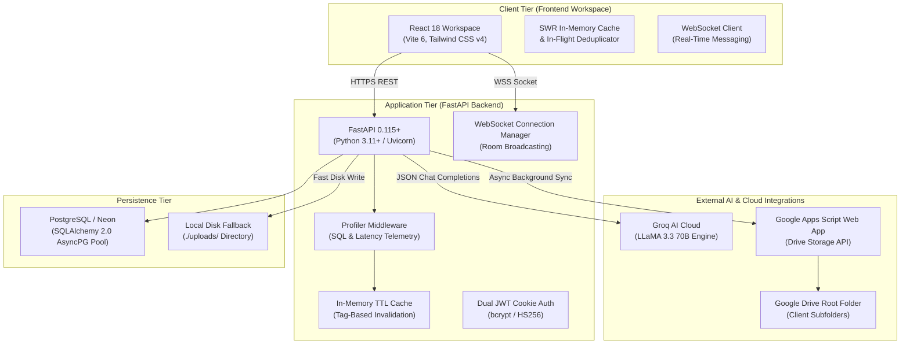
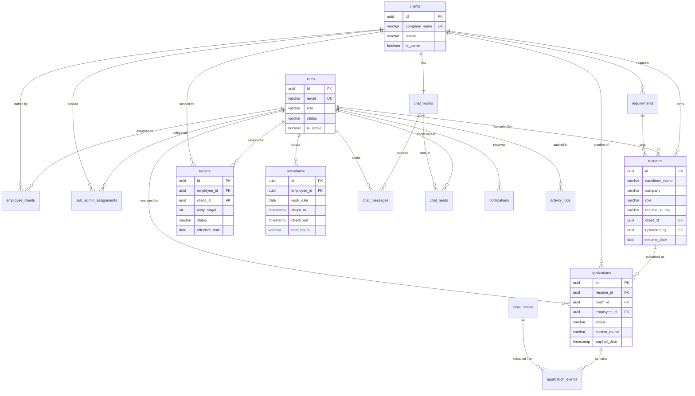
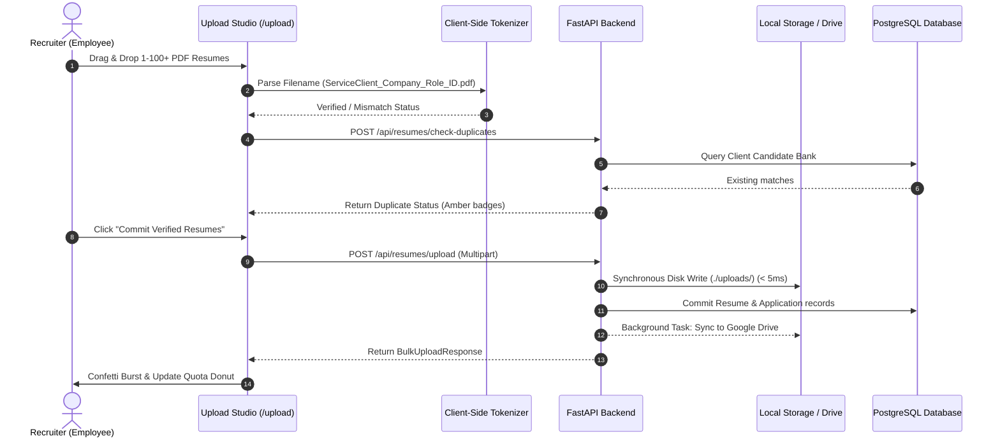
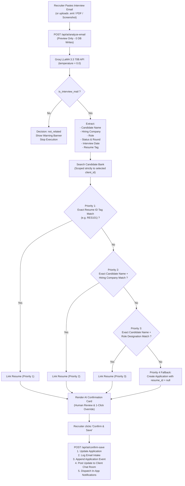
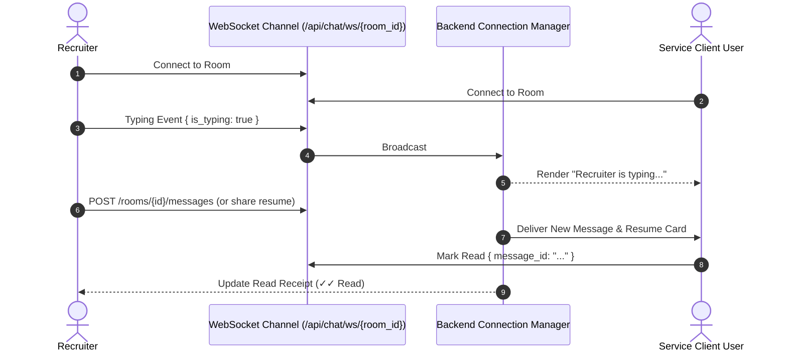
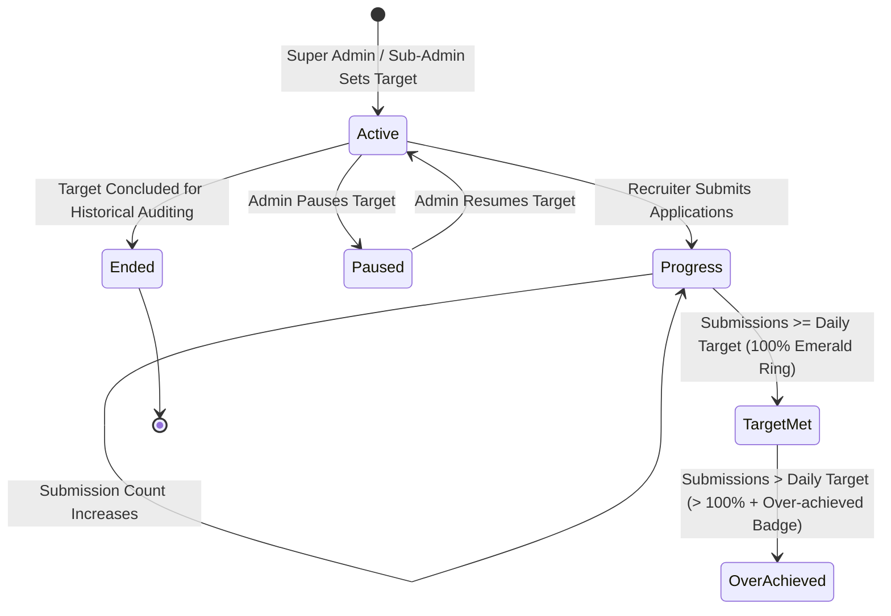

# ApplyFlow ATS — Complete Architecture Diagrams (Mermaid)

> **Specification Version**: 1.2.0  
> **Visual Standards**: GitHub Flavored Mermaid Diagrams covering topologies, relational ERDs, state machines, and sequence workflows

---

## 1. System Topology & Infrastructure

---

## 2. Entity Relationship Diagram (ERD)

---

## 3. Batch Resume Ingestion Pipeline

---

## 4. Groq AI Email Interview Intake & 4-Tier Matching

---

## 5. Real-Time Chat WebSocket Flow

---

## 6. Daily Target Quota Lifecycle

